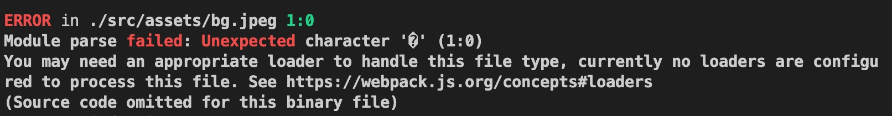
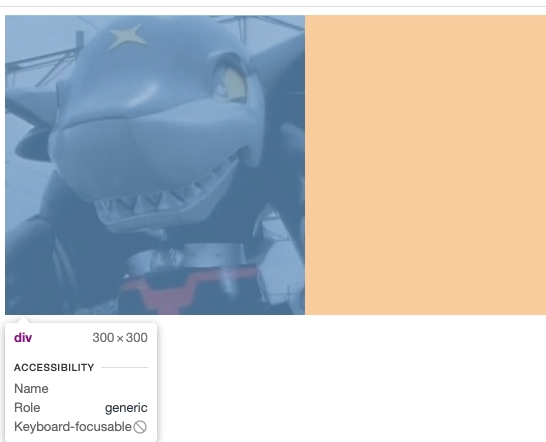
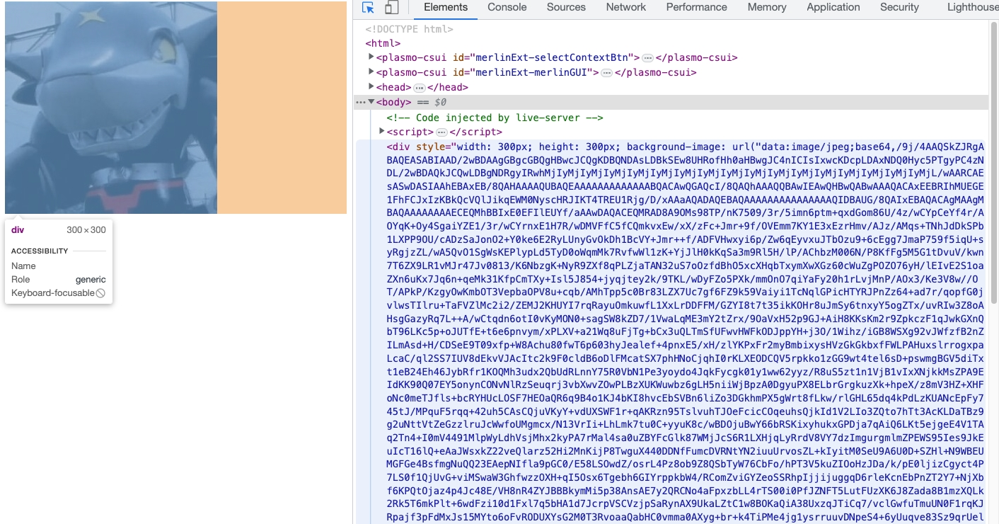
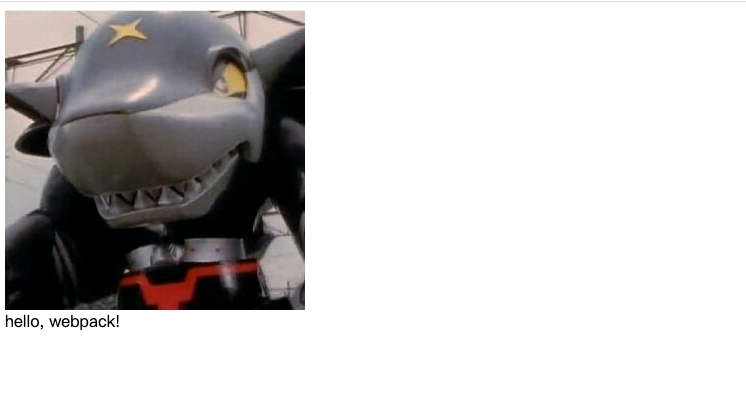

<!--
 * Author  rhys.zhao
 * Date  2023-03-02 14:14:59
 * LastEditors  rhys.zhao
 * LastEditTime  2023-03-06 16:25:50
 * Description
-->

# asset

日常开发的项目中，除了 js 和 css，还有一些静态资源文件。在 webpack4 中这些静态资源文件也是交由 loader 处理的。

而 webpack5 中内置了这些 loader。我们直接通过配置使用 asset 即可。

## 引入图片资源

在 src 下新建 assets 目录，添加 `bg.jpeg` 文件。

```
webpack-demo
├─ src
│  ├─ assets
│  │  └─ bg.jpeg
│  ├─ index.js
│  ├─ index.less
│  └─ math.js
├─ package-lock.json
├─ package.json
└─ webpack.config.js
```

然后在`index.js`中增加一个 div, div 的背景是`bg.jpeg`.

```js
import add from './math.js';
import './index.less';
import bgImg from './assets/bg.jpeg';

console.log(add(1, 2));

const box = document.createElement('div');
box.style.width = '300px';
box.style.height = '300px';
box.style.backgroundImage = `url(${bgImg})`;
document.body.appendChild(box);
```

最后`npx webpack`来打包，则会报错:



接着，我们配置 asset 选项：

## asset 配置

```js
const HtmlWebpackPlugin = require('html-webpack-plugin');
const path = require('path');
module.exports = {
  entry: './src/index.js',
  output: {
    filename: 'bundle.js',
    path: path.resolve(__dirname, './dist'),
    clean: true
  },
  module: {
    rules: [
      {
        test: /\.less$/,
        use: ['style-loader', 'css-loader', 'less-loader']
      },
      {
        test: /\.(png|svg|jpg|jpeg|gif)$/i,
        type: 'asset'
      }
    ]
  },
  plugins: [new HtmlWebpackPlugin()],
  mode: 'development'
};
```

我们再打包, 打包成功。dist 目录下多了个图片文件。打开 `dist/index.html` ,可以看到，我们图片生效了。



## asset 分类

asset 主要有以下四种分类:

- `asset/resource`: 文件被发送到输出目录，并且其路径将被注入到 bundle 中

- `asset/inline`: 作为 data URI 注入到 bundle 中

- `asset`: 自动在 resource 和 inline 之间进行选择：小于 8kb 的文件，将会视为 inline 类型，否则会被视为 resource 类型

- `asset/source`: 直接将文件内容注入到 bundle 中

上面引入图片资源就是使用了`asset`类型, 下面我们逐个使用下另外三种类型：

1. `asset/resource`

修改`webpack.config.js`:

```js{16-19}
const HtmlWebpackPlugin = require('html-webpack-plugin');
const path = require('path');
module.exports = {
  entry: './src/index.js',
  output: {
    filename: 'bundle.js',
    path: path.resolve(__dirname, './dist'),
    clean: true
  },
  module: {
    rules: [
      {
        test: /\.less$/,
        use: ['style-loader', 'css-loader', 'less-loader']
      },
      {
        test: /\.(png|svg|jpg|jpeg|gif)$/i,
        type: 'asset/resource'
      }
    ]
  },
  plugins: [new HtmlWebpackPlugin()],
  mode: 'development'
};
```

打包后查看效果，会发现跟之前一样。这是因为我们的 `bg.jpeg`大于 8kb，`asset` 类型会自动视其为 `asset/resource` 类型

2. `asset/inline`

修改`webpack.config.js`:

```js{2-4}
// ...
{
  test: /\.(png|svg|jpg|jpeg|gif)$/i,
  type: 'asset/inline'
}
// ...
```

再次打包, 我们发现 dist 里没有图片了。打开 html 会发现，图片变成 base64 内联到页面里了。



3. `asset/source`
   在 assets 目录下新建`hello.txt`文件, 新增以下内容:

```txt
hello, webpack!
```

此时, 项目目录如下：

```
webpack-demo
├─ src
│  ├─ assets
│  │  ├─ bg.jpeg
│  │  └─ hello.txt
│  ├─ index.js
│  ├─ index.less
│  └─ math.js
├─ babel.config.js
├─ package-lock.json
├─ package.json
└─ webpack.config.js
```

然后，我们修改`index.js`：

```js{4,14-16}
import add from './math.js';
import './index.less';
import bgImg from './assets/bg.jpeg';
import helloText from './assets/hello.txt';

console.log(add(1, 2));

const box = document.createElement('div');
box.style.width = '300px';
box.style.height = '300px';
box.style.backgroundImage = `url(${bgImg})`;
document.body.appendChild(box);

const textDiv = document.createElement('div');
textDiv.innerHTML = helloText;
document.body.appendChild(textDiv);
```

最后，我们在 `webpack.config.js` 增加对 txt 文件的处理：

```js{20-23}
const HtmlWebpackPlugin = require('html-webpack-plugin');
const path = require('path');
module.exports = {
  entry: './src/index.js',
  output: {
    filename: 'bundle.js',
    path: path.resolve(__dirname, './dist'),
    clean: true
  },
  module: {
    rules: [
      {
        test: /\.less$/,
        use: ['style-loader', 'css-loader', 'less-loader']
      },
      {
        test: /\.(png|svg|jpg|jpeg|gif)$/i,
        type: 'asset/resource'
      },
      {
        test: /\.txt$/,
        type: 'asset/source'
      }
    ]
  },
  plugins: [new HtmlWebpackPlugin()],
  mode: 'development'
};
```

打包后查看效果, 会发现 txt 中的内容直接被注入进来了。


## 总结

1. 对于静态资源文件，我们使用 asset 来处理
2. asset 的四种分类：

- `asset/resource`: 文件被发送到输出目录，并且其路径将被注入到 bundle 中

- `asset/inline`: 作为 data URI 注入到 bundle 中

- `asset`: 自动在 resource 和 inline 之间进行选择：小于 8kb 的文件，将会视为 inline 类型，否则会被视为 resource 类型

- `asset/source`: 直接将文件内容注入到 bundle 中
