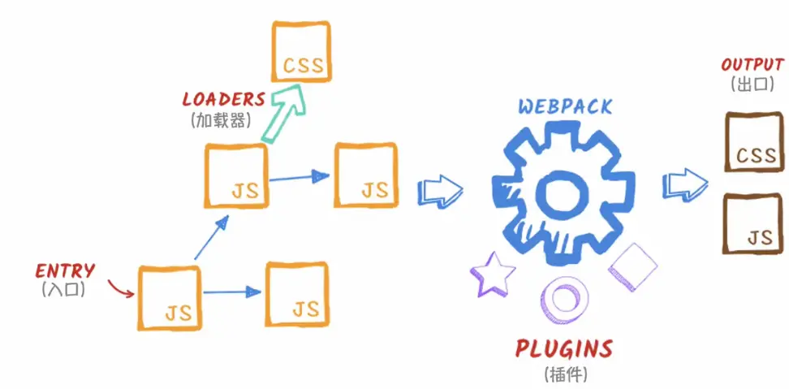
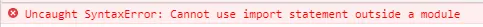
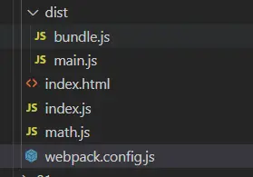

<!--
 * Author  rhys.zhao
 * Date  2023-02-24 11:16:58
 * LastEditors  rhys.zhao
 * LastEditTime  2023-03-06 13:59:38
 * Description
-->

# 从一个简单的例子开始

学习 webpack 之前，首先要了解什么是 webpack，webpack 解决了什么问题。

## webpack 是什么

> 本质上，webpack 是一个现代 JavaScript 应用程序的静态模块打包器(module bundler)。



当 webpack 处理应用程序时，它会递归地构建一个依赖关系图(dependency graph)，其中包含应用程序需要的每个模块，然后将所有这些模块打包成一个或多个 bundle。

简单来说，就是 webpack 从入口文件开始，把项目中所有的文件都串起来，然后整合成一个或多个文件。

## 为什么要用 webpack

创建一个目录`webpack-demo`, 然后`npm init -y`创建项目。

修改项目目录结构如下：

```
webpack-demo
├─ src
│  ├─ index.js
│  └─ math.js
├─ index.html
├─ package-lock.json
└─ package.json
```

在`math.js`, `index.js`分别加入以下代码：

```js
// math.js
const add = (a, b) => {
  return a + b;
};
export default add;
```

```js
// index.js
import add from './math.js';
console.log(add(1, 2));
```

然后我们在`index.html`中引入`index.js`:

```html
<body>
  <script src="./index.js"></script>
</body>
```

然后我们在浏览器中打开`index.html`，会发现控制台报错了：



这是因为浏览器不能够识别 ES6 里的 import 语句导致的（其实现在主流的浏览器都支持 ESM 了，只需要在 script 标签里配置`type="module"`即可）。

## 使用 webpack

### 1. 安装 webpack

直接使用 npm 安装即可

```shell
npm i webpack webpack-cli -D
```

### 2. 运行 webpack

webpack 是开箱即用的，直接运行 webpack 命令即可。

```
npx webpack
```

打包后，项目根目录会生成一个`dist`文件，里面有个`main.js`文件（打包后的 js 文件）。

我们在`index.html`中引入`main.js`:

```html
<body>
  <script src="./dist/main.js"></script>
</body>
```

然后在浏览器打开, 会发现代码执行的结果 3

这样我们就通过 webpack 将`index.js`与`math.js`打包成了一个 js 文件`main.js`。

## webpack 配置文件

通过命令行打包文件，不能够直观的看到我们的一些配置。因此 webpack 提供了通过文件去自定义配置的能力。在根目录下新建`webpack.config.js`文件：

在文件中加入以下代码：

```js
// webpack.config.js
const path = require('path'); // node内置对象，直接引入即可
module.exports = {
  entry: './index.js',
  output: {
    filename: 'bundle.js',
    path: path.resolve(__dirname, './dist')
  },
  mode: 'development'
};
```

webpack 运行在 node 环境中，使用的是 node 中的 commonJs 模块语法，所以使用`module.exports`来定义。

- `entry`: 入口文件，默认值是 `./src/index.js`。

- `ouput`: 输出文件名和路径。需要注意的是，输出路径必须是绝对路径。因此，这里我们使用了`path.resolve(__dirname, './dist')`来获取绝对路径。

- `mode`: webpack 的打包模式，一般有 development 和 production 两种。

然后我们通过`npx webpack`命令来打包，会发现 dist 中出现了一个`bundle.js`文件，这就是我们打包生成的文件。



在`index.html`中引入`bundle.js`:

```html
<body>
  <script src="./dist/bundle.js"></script>
</body>
```

然后在浏览器打开, 同样会出现代码执行的结果 3

## 总结

1. 安装 webpack `npm i webpack webpack-cli -D`
2. 运行 webpack `npx webpack`
3. 默认 webpack 配置文件 webpack.config.js (entry, output, mode)

**参考资料：**

[webpack 官方文档](https://webpack.docschina.org/)
