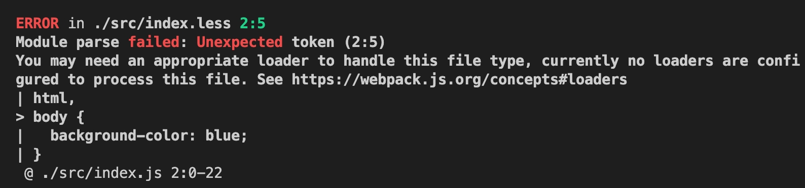
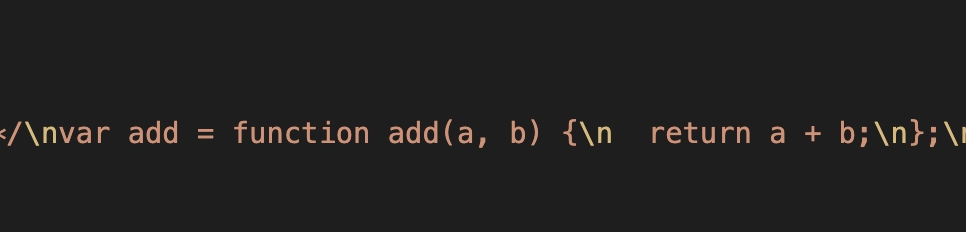

<!--
 * Author  rhys.zhao
 * Date  2023-03-01 16:52:03
 * LastEditors  rhys.zhao
 * LastEditTime  2023-03-06 15:33:25
 * Description
-->

# loader

webpack 本身只能处理 js / json 类型的文件。至于不能处理的其他代码文件，一般交由 loader 去处理。比如：

less-loader 用来处理 less 文件，css-loader 用来处理 css 文件。

## 引入样式

在之前的目录里增加 `index.less` 文件。此时项目目录如下：

```
webpack-demo
├─ src
│  ├─ index.js
│  ├─ index.less
│  └─ math.js
├─ package-lock.json
├─ package.json
└─ webpack.config.js
```

给`index.less`添加一点样式代码，并在`index.js`中引入`index.less`:

```less
// index.less
html,
body {
  background-color: blue;
}
```

```js
// index.js
import add from './math.js';
import './index.less'; // 新增代码

console.log(add(1, 2));
```

然后我们`npx webpack`打包，则会报错如下：



前面说过，webpack 只能处理 js / json 文件。如果有其他不能处理的文件类型，交由 loader 处理。

## 处理 less 文件

### 1. 相关 loader 介绍

css 常用 loader 有`less-loader`,`css-loader`,`style-loader`。它们的作用如下：

`less-loader`: 负责处理 less 文件，将 less 转换为 css

`css-loader`: 负责处理 css 文件

`style-loader`: 负责将 css-loader 处理后的内容插入到 html 中

### 2. 安装相关 loader

```shell
npm i style-loader css-loader less-loader -D
```

### 3. loader 配置

loader 本质上是一个函数。安装后，直接使用即可。我们修改一下`webpack.config.js`的配置:

```js
const HtmlWebpackPlugin = require('html-webpack-plugin');
const path = require('path');
module.exports = {
  entry: './src/index.js',
  output: {
    filename: 'bundle.js',
    path: path.resolve(__dirname, './dist'),
    clean: true
  },
  module: {
    rules: [
      {
        test: /\.less$/,
        use: ['style-loader', 'css-loader', 'less-loader']
      }
    ]
  },
  plugins: [new HtmlWebpackPlugin()],
  mode: 'development'
};
```

loader 的配置在 `module.rules` 里，`test` 用来正则匹配项目中的文件，`use` 用来使用 loader。
需要注意的是，**loader 的运行顺序是从后往前**。也就是说，我们的 less 文件从后到前依次被`less-loader`,`css-loader`,`style-loader`处理。

使用`npx webpack`命令打包，然后打开`dist`目录下的`index.html`。我们能够看到，页面背景变成了蓝色。我们的 less 代码生效了。

## 处理 js 文件

我们使用 babel-loader 进行 js 文件的处理。可能有人要问，不是说 webpack 能够处理 js 文件吗, 为什么还要再处理?

其实，webpack 对 js 的处理仅限于模块化的处理。至于 ES6 降级之类的能力，webpack 本身是不具备的。为了兼容一些低版本的浏览器，我们使用 babel-loader 处理 js 文件。

### 1. babel-loader 介绍

babel-loader 基于 Babel，允许我们使用 Babel 和 webpack 转译 js 文件。
使用 Babel 需要安装两个依赖，`@babel/core`和`@babel/preset-env`。

- `@babel/core`: 使用 Babel 进行转码的核心包
- `@babel/preset-env`: 一组插件预设，允许我们使用最新的 JavaScript

### 2. 安装

```shell
npm install -D babel-loader @babel/core @babel/preset-env
```

### 3. 配置

有两种配置方式:

- 直接在 options 里配置

```js{12-22}
const HtmlWebpackPlugin = require('html-webpack-plugin');
const path = require('path');
module.exports = {
  entry: './src/index.js',
  output: {
    filename: 'bundle.js',
    path: path.resolve(__dirname, './dist'),
    clean: true
  },
  module: {
    rules: [
      {
        test: /\.js$/,
        use: [
          {
            loader: 'babel-loader',
            options: {
              presets: ['@babel/preset-env']
            }
          }
        ]
      },
      {
        test: /\.less$/,
        use: ['style-loader', 'css-loader', 'less-loader']
      }
    ]
  },
  plugins: [new HtmlWebpackPlugin()],
  mode: 'development'
};
```

- 也可以配置在 `babel.config.js` 里

首先, 删除`webpack.config.js` babel-loader 相关的 options:

```js{2-5}
// ...
{
  test: /\.js$/,
  use: ['babel-loader']
},
// ...

```

然后, 在根目录下新建`babel.config.js`。 此时项目的目录结构如下：

```
webpack-demo
├─ src
│  ├─ index.js
│  ├─ index.less
│  └─ math.js
├─ babel.config.js
├─ package-lock.json
├─ package.json
└─ webpack.config.js
```

接着在`babel.config.js`里增加内容：

```js
module.exports = {
  presets: ['@babel/preset-env']
};
```

推荐单独配置的方式，这样即使后续配置比较多，看起来也非常清晰。

配置完 babel-loader，打包并查看一下 bundle 里的内容。会发现之前的箭头函数已经被转译成 ES5 的 function 了。


## 总结

1. webpack 本身只能处理 js / json 类型的文件。至于不能处理的其他代码文件，一般交由 loader 去处理。
2. loader 本质上是一个函数。安装后，直接使用即可。
3. 处理 css 相关的 loader:

- `less-loader`: 负责处理 less 文件，将 less 转换为 css

- `css-loader`: 负责处理 css 文件

- `style-loader`: 负责将 css-loader 处理后的内容插入到 html 中

4. babel-loader

**参考资料：**

[webpack 官方文档](https://webpack.docschina.org/)
