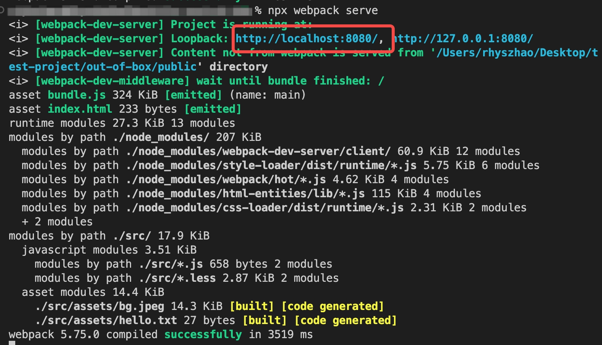

<!--
 * Author  rhys.zhao
 * Date  2023-03-02 15:22:40
 * LastEditors  rhys.zhao
 * LastEditTime  2023-03-06 16:43:35
 * Description
-->

# 开发服务器

每次写完代码都需要手动打包, 然后查看效果太麻烦了。怎么才能改完代码立即就能查看？

## webpack-dev-server

webpack-dev-server 能够给我们开启一个开发服务器。每当我们代码改动后，它会在内存里打包，并自动更新到浏览器。

### 安装

```
npm i webpack-dev-server -D
```

### 配置

```js{31-35}
const HtmlWebpackPlugin = require('html-webpack-plugin');
const path = require('path');
module.exports = {
  entry: './src/index.js',
  output: {
    filename: 'bundle.js',
    path: path.resolve(__dirname, './dist'),
    clean: true
  },
  module: {
    rules: [
      {
        test: /\.js$/,
        use: ['babel-loader']
      },
      {
        test: /\.less$/,
        use: ['style-loader', 'css-loader', 'less-loader']
      },
      {
        test: /\.(png|svg|jpg|jpeg|gif)$/i,
        type: 'asset/inline'
      },
      {
        test: /\.txt$/i,
        type: 'asset/source'
      }
    ]
  },
  plugins: [new HtmlWebpackPlugin()],
  devServer: {
    host: 'localhost', // 启动服务器域名
    port: '8080', // 端口
    open: true // 自动打开浏览器
  },
  mode: 'development'
};
```

### 运行

运行开发服务器，只需要执行 `npx webpack serve` 命令即可。



打开 `http://localhost:8080`，效果如下：


## 增加 scripts 命令

到目前为止，我们运行了两个命令，不妨把它们配置到`package.json`里:

```json{2-5}
// ...
  "scripts": {
    "start": "webpack serve",
    "build": "webpack",
  },
// ...
```

这样，我们运行 `npm start` 就会启动本地服务 `http://localhost:8080`, 运行 `npm run build` 就会把项目打包到 dist 目录。

## 总结

1. webpack-dev-server
2. npm scripts 配置
